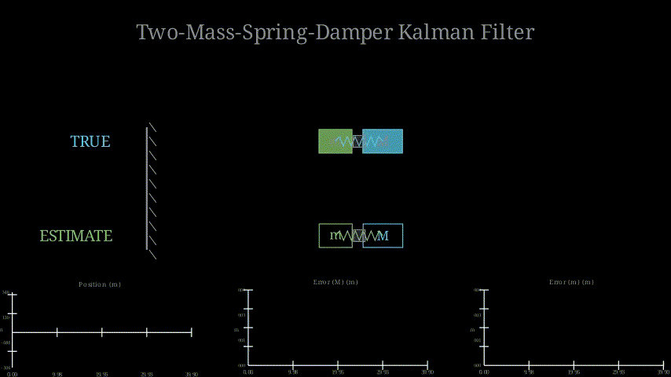

# determined
A lightweight library for some basic filtering methods

## Documentation

This crate implements small, statically-sized Kalman and Extended Kalman Filter
implementations using nalgebra's `SMatrix` for predictable, allocation-free
linear algebra.

Generate API documentation locally with:

```bash
cargo doc --open
```

The main modules are:
- `crate::common` — core traits and type aliases (includes `Algorithm` trait).
- `crate::algorithms` — Kalman and EKF implementations.
- `crate::state` — small `State<R,C>` wrapper around nalgebra matrices.
- `crate::measurement` — measurement/observation helpers.
- `crate::models` — traits for state transition and measurement models used by EKF.

## Examples


Check out examples for `python` bindings and the core `rust` library in `/examples`.  To run `rust` examples use `cargo`:
```bash
cargo run --example < example_name >
```

To run the visualisation example using `python` and `manim` use:
```bash
manim -pql examples/manim_two_mass_spring_damper.py TwoMassSpringDamperScene
```

